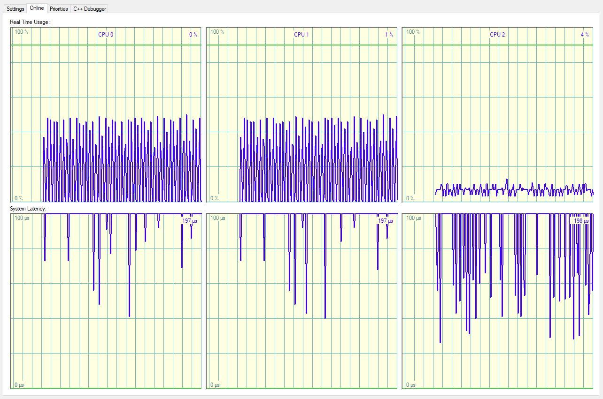
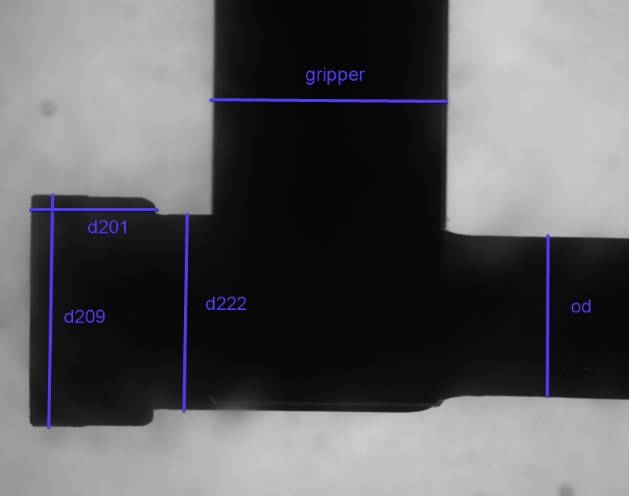
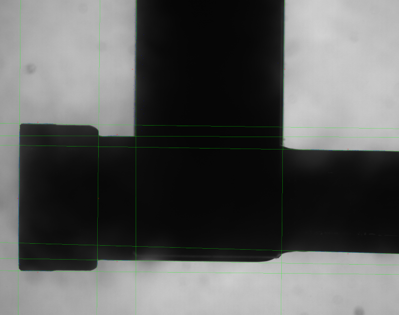
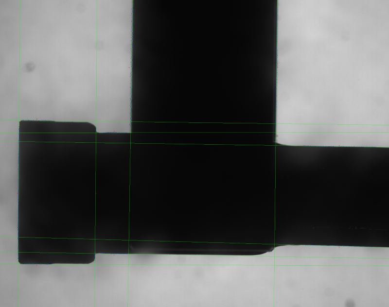

## Introduction
With Beckhoff's new built in Vision system, all metrology can be done directly on the IPC itself. Sizing IPC power correctly is even more critical as some vision functions can take a lot of CPU cycles and depending on a machine's cycle time might not be able to complete in alloted time.

See this first [vision post](/twincat-vision-part-1/) for an introduction about TwinCAT Vision and how I did initial setup.

## Test Setup
These tests were run on a ThinkPad P52 running Windows 10 v1809 with TwinCAT 4024.12 and Tc3_Vision 4.0.1.0. Using an i7-8750H and 16GB ram. While running the tests the i7 was running at a speed of 4 GHz. The system was configured to use a total of 3 shared cores with a 90% limit. One core for the base vision task and one core for a vision job pool task. The third core ran the remaining tasks. The vision task was set to 200ms cycle.

Each test will have the CPU usage reported. Since the task time is 200ms (which is long) all vision computations finish well within that range and thus there is a wait time in between the start of the next computation where the CPU does nothing. I will report the CPU approximate spike percentage.

The image is from a 5MP Smart [Camera](https://www.bannerengineering.com/us/en/products/part.803203.html) from Banner Engineering using an Opto-e telecentric [lens](https://www.opto-e.com/products/TC2MHR056-C).

All tests were run sequentially 100 times and minimum, average and maximum computation times were recorded for each dimension in micro seconds as well as its measurement result in pixels. Here are the five dimensions being measured in the image and their specific configurations. The pixel count is based on the inspection region, gap and lines. It is calculated as `pixel = (to - from - gap) * lines`.

| Name | Start Point | End Point | Search Gap | Search Lines | Line Distance | Pixel Count |
| ---- | ----- |----- |---- |------ | -------- | ----------- |
| d201 | [115, 1290] | [640, 1290] | 420 | 291 | 3 | 30555 |
| d209 | [245, 795] | [245, 1770] | 780 | 49 | 4 | 9555 |
| d222 | [760, 875] | [760, 1700] | 660 | 45 | 4 | 7425 |
| od | [2260, 970] | [2260, 1650] | 680 | 121 | 4 | 20570 |
| gripper | [860, 450] | [1850, 450] | 792 | 161 | 5 | 31878 |

Here are the measurements. Full resolution original [image](/vision-original.png).

The tests were done using the [F_VN_MeasureEdgeDistanceExp](https://infosys.beckhoff.com/english.php?content=../content/1033/tf7xxx_tc3_vision/9007207520351499.html#5563038987&id=) function. Here's the documentation on all the [parameters](https://infosys.beckhoff.com/english.php?content=../content/1033/tf7xxx_tc3_vision/18014406771577483.html&id=) used.

## Tests with TCVN_EDA_APPROX_ERF
### Test 1
Settings used.

| Name | Value |
| ---- | ----- |
| Min Strength | 50 |
| Max Thickness | 10 |
| Precision | 0.001 |
| Subpixel Iteration | 10 |
| Algorithm | TCVN_EDA_APPROX_ERF |

Here are the results. The two vision cores where at approximately 10% spike load as seen in the Twincat real time online tab.

| Name | Min (us) | Avg (us) | Max (us) | Avg / Pixel (us) | Result in Pixels |
| ---- | -------- | -------- | -------- | ---------------- | ---------------- |
| d201 | 4478 | 4801 | 5865 | 0.16 | 812.82 |
| d209 | 1525 | 1700 | 2214 | 0.18 | 959.33 |
| d222 | 1346 | 1515 | 1953 | 0.20 | 808.45 |
| od | 3511 | 3904 | 5076 | 0.19 | 664.49 |
| gripper | 6505 | 7112 | 8122 | 0.22 | 965.83 |

### Test 2
Settings used.

| Name | Value |
| ---- | ----- |
| Min Strength | 50 |
| Max Thickness | 10 |
| Precision | 0.001 |
| Subpixel Iteration | 100 |
| Algorithm | TCVN_EDA_APPROX_ERF |

Here are the results. The two vision cores where at approximately 45% spike load as seen in the Twincat real time online tab.

| Name | Min (us) | Avg (us) | Max (us) | Avg / Pixel (us) | Result in Pixels |
| ---- | -------- | -------- | -------- | ---------------- | ---------------- |
| d201 | 29585 | 30927 | 35517 | 1.01 | 812.46 |
| d209 | 11302 | 11963 | 13830 | 1.25 | 957.96 |
| d222 | 9727 | 10362 | 12027 | 1.39 | 807.06 |
| od | 26665 | 27951 | 30871 | 1.36 | 662.95 |
| gripper | 67822 | 71886 | 77261 | 2.25 | 963.64 |

### Test 3
Settings used.

| Name | Value |
| ---- | ----- |
| Min Strength | 50 |
| Max Thickness | 10 |
| Precision | 0.001 |
| Subpixel Iteration | 1000 |
| Algorithm | TCVN_EDA_APPROX_ERF |

Here are the results. The two vision cores where at approximately 60% spike load as seen in the Twincat real time online tab.

| Name | Min (us) | Avg (us) | Max (us) | Avg / Pixel (us) | Result in Pixels |
| ---- | -------- | -------- | -------- | ---------------- | ---------------- |
| d201 | 34319 | 35816 | 39284 | 1.17 | 812.11 |
| d209 | 14411 | 15085 | 16807 | 1.58 | 957.76 |
| d222 | 11994 | 12568 | 13776 | 1.69 | 806.95 |
| od | 32984 | 33315 | 37540 | 1.62 | 662.92 |
| gripper | 94861 | 97324 | 102503 | 3.05 | 958.19 |

### Test 4
Settings used.

| Name | Value |
| ---- | ----- |
| Min Strength | 50 |
| Max Thickness | 10 |
| Precision | 0.0001 |
| Subpixel Iteration | 1000 |
| Algorithm | TCVN_EDA_APPROX_ERF |

Here are the results. The two vision cores where at approximately 85% spike load as seen in the Twincat real time online tab.

| Name | Min (us) | Avg (us) | Max (us) | Avg / Pixel (us) | Result in Pixels |
| ---- | -------- | -------- | -------- | ---------------- | ---------------- |
| d201 | 55528 | 57726 | 62073 | 1.89 | 812.11 |
| d209 | 23445 | 24563 | 27780 | 2.57 | 957.76 |
| d222 | 27214 | 28389 | 31264 | 3.82 | 806.95 |
| od | 75794 | 79117 | 83104 | 3.85 | 662.92 |
| gripper | 138609 | 150059 | 158836 | 4.71 | 958.18 |

This is the resulting image with edge lines and points from test 4. Full resolution [image](/vision-erf.png).

## Tests with TCVN_EDA_INTERPOLATION
### Test 1
Settings used.

| Name | Value |
| ---- | ----- |
| Min Strength | 50 |
| Max Thickness | 10 |
| Subpixel Iteration | 10 |
| Algorithm | TCVN_EDA_INTERPOLATION |

Here are the results. The two vision cores where at approximately 1% spike load as seen in the Twincat real time online tab.

| Name | Min (us) | Avg (us) | Max (us) | Avg / Pixel (us) | Result in Pixels |
| ---- | -------- | -------- | -------- | ---------------- | ---------------- |
| d201 | 1316 | 1416 | 2014 | 0.05 | 812.32 |
| d209 | 345 | 403 | 1005 | 0.04 | 958.71 |
| d222 | 280 | 412 | 650 | 0.06 | 807.82 |
| od | 669 | 789 | 1168 | 0.04 | 663.80 |
| gripper | 1102 | 1261 | 1737 | 0.04 | 964.64 |

### Test 2
Settings used.

| Name | Value |
| ---- | ----- |
| Min Strength | 50 |
| Max Thickness | 10 |
| Subpixel Iteration | 25 |
| Algorithm | TCVN_EDA_INTERPOLATION |

Here are the results. The two vision cores where at approximately 3% spike load as seen in the Twincat real time online tab.

| Name | Min (us) | Avg (us) | Max (us) | Avg / Pixel (us) | Result in Pixels |
| ---- | -------- | -------- | -------- | ---------------- | ---------------- |
| d201 | 2027 | 2203 | 3003 | 0.07 | 812.32 |
| d209 | 564 | 676 | 1176 | 0.07 | 959.20 |
| d222 | 502 | 684 | 1399 | 0.09 | 808.36 |
| od | 1251 | 1461 | 2482 | 0.07 | 664.32 |
| gripper | 1794 | 2141 | 3193 | 0.07 | 964.93 |

### Test 3
Settings used.

| Name | Value |
| ---- | ----- |
| Min Strength | 50 |
| Max Thickness | 10 |
| Subpixel Iteration | 50 |
| Algorithm | TCVN_EDA_INTERPOLATION |

Here are the results. The two vision cores where at approximately 5% spike load as seen in the Twincat real time online tab.

| Name | Min (us) | Avg (us) | Max (us) | Avg / Pixel (us) | Result in Pixels |
| ---- | -------- | -------- | -------- | ---------------- | ---------------- |
| d201 | 3147 | 3362 | 4712 | 0.11 | 812.32 |
| d209 | 1021 | 1135 | 1572 | 0.12 | 959.19 |
| d222 | 917 | 1020 | 1564 | 0.14 | 808.36 |
| od | 2095 | 2309 | 3456 | 0.11 | 664.46 |
| gripper | 3059 | 3413 | 4786 | 0.11 | 965.00 |

### Test 4
Settings used.

| Name | Value |
| ---- | ----- |
| Min Strength | 50 |
| Max Thickness | 10 |
| Subpixel Iteration | 100 |
| Algorithm | TCVN_EDA_INTERPOLATION |

Here are the results. The two vision cores where at approximately 10% spike load as seen in the Twincat real time online tab.

| Name | Min (us) | Avg (us) | Max (us) | Avg / Pixel (us) | Result in Pixels |
| ---- | -------- | -------- | -------- | ---------------- | ---------------- |
| d201 | 5462 | 5860 | 8200 | 0.19 | 812.32 |
| d209 | 1792 | 2111 | 3092 | 0.22 | 959.19 |
| d222 | 1641 | 1910 | 2766 | 0.26 | 808.36 |
| od | 3732 | 4281 | 5820 | 0.21 | 664.46 |
| gripper | 5484 | 6208 | 8313 | 0.19 | 965.00 |

This is the resulting image with edge lines and points from test 4. Full resolution [image](/vision-inter.png).

## Analysis CPU
There is a lot of information to analyze, and this is only the tip of the vision iceberg. I only did edge finding and distance calculation using two different algorithms. Beckhoff vision has hundreds of different functions that can be used. In a future application once initial testing is completed the vision task cycle time should be set to be 10-20% larger than the maximum time a function takes to finish. This will reduce dead time waiting for the task to complete a cycle before getting the results back.

When sizing an IPC for vision application this is where the Average time / Pixel can be used to make an educated guess. Based on inspection requirements you will know camera resolution and thus approximate pixel count used in inspection. Keep in mind that these times are using two cores running at 4 GHz. Core speed should be pretty linear with a 2 GHz core taking twice the time. Core count (Job Pool Tasks) are perfectly linear given the overhead of parallelizing the jobs, but for sizing purposes can be taken as linear. Using a single core would therefore take twice the time.

## Analysis Measurement
Each set of tests started with parameters which required less iterations, less CPU and potentially were less accurate. There is a reason I stopped increasing the iteration of the tests after four tries. If you look at the Result in Pixels column for the test you will see there is no difference between the third and fourth test. That is we have hit the limit of resolution that the original image allows. Increasing parameters from this point would give no benefit at all. I would also consider that the best accuracy of the system has been reached at that point.

The values I ended up with for subpixel iteration were 5-10 times larger than Beckhoff's highest recommended value and precision matched Beckhoff's highest recommended value.

Let's compare test 4 measurements of the two algorithms. I will disregard the difference for the gripper measurement since it is outside the telecentric field of depth and also has two gripper fingers on different planes. All the other measurements are done on the test piece.

| Algorithm | d201 | d209 | d222 | od | gripper |
| --------- | ---- | ---- | ---- | -- | ------- |
| TCVN_EDA_INTERPOLATION | 812.32 | 959.19 | 808.36 | 664.46 | 965.00 |
| TCVN_EDA_APPROX_ERF | 812.11 | 957.76 | 806.95 | 662.92 | 958.18 |
| Difference | 0.21 | 1.43 | 1.41 | 1.54 | 6.82 |

In this specific application the px mm ratio is 47.354px = 1mm. Between the two algorithms that would give a maximal difference of 0.03mm. This approximately follows the rule of thumb saying that a vision system's resolution should be 10 times better than the dimension resolution. In this application dimensions have 0.1mm tolerances.

Taking dimensions d209, d222 and od the delta between differences is 0.11px = 0.002mm. The px/mm ratio will be setup with one algorithm, meaning that for interpolation the ratio is 47.354 and for erf the ratio is 47.282. This gives another way to look at this is deviation over the measurements for each algorithm. This would more closely follow how it would be used since only one algorithm would be used in production.

> See this blog about [Beckhoff Vision and how it is not robust](/twincat-vision-edge-distance-incorrect-results/) for why I left out d201 in the last number crunching. Spoiler, it's way off.

## Conclusion
Even with a higher than recommended sub pixel iteration count, the Interpolation algorithm is an order of magnitude faster than the ERF algorithm. This is expected, but now it is quantifiable. The time / pixel for the ERF algorithm will likely be influenced by the edge quality in the image, while the interpolation less so.

There are many other edge finding algorithms out there, and Beckhoff does implement a few of them as specific methods and not part of dedicated metrology methods. This is an area of further investigation. As with everything, it will come down to the specific application.

Beckhoff's documentation states that ERF is more robust than Interpolation. This is an area that would need further investigation in a real world scenario. The testing done here was on a single static image. Thankfully both algorithms always gave the exact same results with the same input parameters over many runs on the same image. In production, there will be some differences in part alignment for each image and it would be interesting to see those results.

Good suppliers are always keen about helping you out with testing and verification of a process before any purchase when it comes to vision applications. I would highly recommend that this be done and develop the software algorithms from with the test images provided.

