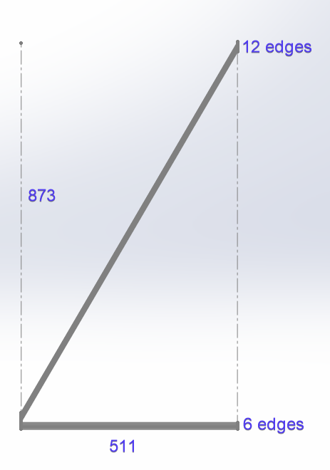

## Introduction
I will say up front, I consider this being more of an edge case than a regular use case. Nevertheless this shows it is very important to sanitize and verify results and that algorithm implementation can have huge effects to end results.

For reference here is the function F_VN_MeasureEdgeDistanceExp.

```typescript
FUNCTION F_VN_MeasureEdgeDistanceExp : HRESULT
VAR_INPUT
    ipSrcImage             : ITcVnImage;
    fAvgDistance           : Reference To  REAL;
    aStartPoint            : Reference To  TcVnPoint2_REAL;
    aEndPoint              : Reference To  TcVnPoint2_REAL;
    eEdgeDirection         : ETcVnEdgeDirection;
    fMinStrength           : REAL;
    nSearchLines           : UDINT;
    fSearchLineDist        : REAL;
    nMaxThickness          : UDINT;
    bInvertSearchDirection : BOOL;
    fSearchGap             : REAL;
    nSubpixelsIterations   : UDINT;
    fApproxPrecision       : REAL;
    eAlgorithm             : ETcVnEdgeDetectionAlgorithm;
    ipEdgePoints1          : Reference To  ITcVnContainer;
    ipEdgePoints2          : Reference To  ITcVnContainer;
    ipDistances            : Reference To  ITcVnContainer;
    hrPrev                 : HRESULT;
END_VAR
```

There are four different outputs I will be using in this post for the explanation.

| Variable | Description | Type | Type Size (bytes) |
| -------- | ----------- | ---- | ----------------- |
| fAvgDistance | Average distance between detected edges | Real | 4 |
| ipEdgePoints1 | Detected edges points of edge 1 | Container of [Real, Real] | 8 |
| ipEdgePoints2 | Detected edges points of edge 2 | Container of [Real, Real] | 8 |
| ipDistances | Distances between detected edge points | Container of Real | 4 |

There are a few extra function that are used to calculate sizes and averages of the return values. [F_VN_ExportContainerSize](https://infosys.beckhoff.com/english.php?content=../content/1033/tf7xxx_tc3_vision/8263695243.html&id=) is used to find the number of elements in the `ipEdgePoints` containers. [F_VN_ContainerAverage](https://infosys.beckhoff.com/english.php?content=../content/1033/tf7xxx_tc3_vision/8262766859.html&id=) is used for finding the average value from the `ipDistances` container. [F_VN_ContainerAverageElementwise2](https://infosys.beckhoff.com/content/1033/tf7xxx_tc3_vision/8262774923.html?id=8193796349599543807) is used for finding the average value of [x, y] coordinates from `ipEdgePoints` containers.

## Dimension 1
I configured the function to look for 49 lines (nSearchLines=49). This returned the following.

| Variable | Description |
| -------- | ----------- |
| fAvgDistance | 957.95 |
| `F_VN_ExportContainerSize(ipEdgePoints1)` | 384 / 8 -> 48 elements |
| `F_VN_ExportContainerSize(ipEdgePoints2)` | 392 / 8 -> 49 elements |
| `F_VN_ContainerAverage(ipDistances)` | 957.95 |
| `F_VN_ExportContainerSize(ipDistances)` | 192 / 4 -> 48 elements |
| `F_VN_ContainerAverageElementwise2(ipEdgePoints1)` | [244.3, 803.67] |
| `F_VN_ContainerAverageElementwise2(ipEdgePoints2)` | [245, 1761.62] |

The number of elements in each `ipEdgePoints` makes sense as it tries to match up with the defined `nSearchLines`. If it cannot find an edge point it will be smaller. Same for `ipDistances` matching the smallest of either `ipEdgePoints`.

This confirms that `fAvgDistance` is the average of `ipDistances` which is the calculated distance between elements of `ipEdgePoints`. Our first unknown is what and how are elements selected when one edge has fewer points than the other. In this case the difference is only one element or about 2%.

Since the inspected dimension is aligned with the Y axis we can easily calculate the distance using the average Y edge values `1761.62 – 803.67 = 957.95`. This, thankfully, matches up with `fAvgDistance`. If the inspected dimension was not aligned with the X or Y axis, then this would involve a little more math and have different ways of doing it.

## Dimension 2
I configured the function to look for 291 lines (nSearchLines=291). This returned the following.

| Variable | Description |
| -------- | ----------- |
| fAvgDistance | 812.46 |
| `F_VN_ExportContainerSize(ipEdgePoints1)` | 2320 / 8 -> 290 elements |
| `F_VN_ExportContainerSize(ipEdgePoints2)` | 144 / 8 -> 18 elements |
| `F_VN_ContainerAverage(ipDistances)` | 812.46 |
| `F_VN_ExportContainerSize(ipDistances)` | 72 / 4 -> 18 elements |
| `F_VN_ContainerAverageElementwise2(ipEdgePoints1)` | [123.00, 1290.55] |
| `F_VN_ContainerAverageElementwise2(ipEdgePoints2)` | [634.83, 1427.30] |

The first thing to notice here is the large difference in elements between the `ipEdgePoints`. The difference is 272 elements or about 94%. Remember the unknown on how and which elements are used for calculating distances and also what algorithm is used. Now it has a huge impact on the final result.

Since the inspected dimension is aligned with the X axis we can easily calculate the distance using the average X edge values `634.83 – 123.00 = 511.83`. This does not match `fAvgDistance`. Knowing the actual dimensions the value of 511.83 is correct whereas 812.46 is incorrect.

## Analysis
The root cause of this discrepancy is the large difference in elements between the two edges. The current algorithm used in F_VN_MeasureEdgeDistanceExp isn't robust enough to deal with this kind of cases. Obviously a difference of 94% of element size is significant, but I would be interested to know at what percentage the current algorithm starts going awry. Is it 25%, 50%, 75%?

The current algorithm likely uses the Euclidean distance between each set of points then averages it all. Let's assume that the length of `ipEdgePoints1` and `ipEdgePoints2` were equal. This would give the following calculation. `ipDistances[i] = sqrt[(ipEdgePoints2[i][x] - ipEdgePoints1[i][x])^2 + (ipEdgePoints2[i][y] - ipEdgePoints1[i][y])^2]`.

As mentioned before, what happens when they are not the same length. There are a few different approaches. You could sample the longer side, in this case every 16th point from side 1 to every one from side 2. Start from either end and ignore middle ones, or the opposite and start from the middle.

Looking at the results of `ipDistances` there are 6 values around 512-513 and 12 values around 957-962. What this tells me is that the algorithm starts calculating Euclidean distances from the start of both arrays and ends at the end of the shortest one effectively truncating the longer one. This is what it would visually look like. The `873 = 291 lines * 3 px line space`.



## Solution
As mentioned before since the measured distance lines up with the X axis, we can use a trivial solution of subtracting the X positions. However this would not work if there was a rotation off X axis.

A solution that would ignore any discrepancy between the number of points would be to best fit two lines to each set of points (linear regression) and then find the distance between the two lines. Using the line with the most points as the base line and thus making the distance tangential to that base line. By doing this you could also easily calculate the angle between both lines. This is actually an important measure when finding distances as you can put thresholds on the angle and if it is more than a few degrees treat it differently or fail the measurement.

## Conclusion
I've used metrology software from a few different suppliers and have done this type of measurement with all of them. It does require playing around with parameters, but so far all the others have been able to correctly measure this kind of dimension with their built in tools, while this one from TwinCAT did not do the job.

However, since TwinCAT vision is low level and I have access to a lot of the underlying results, I was able to (easily) investigate and find the root cause. And I am also just as (easily) able to define and create my own measurement algorithm. The other software packages I've worked with are just black boxes and I would essentially be out of luck if it didn't work.

I really like how TwinCAT Vision is directly integrated into the PLC and gives me nearly ultimate control, but it is not a quick and easy metrology or vision solution as compared to using smart cameras or dedicated vision system. However it will likely prove to be cheaper.

If you're currently using Smart Cameras or drag and drop software then I don't think this is a good solution for you. On the other hand if you're already low level vision (for example Matrox Imaging Library) this could an option.

Let me know what you think of TwinCAT Vision!
