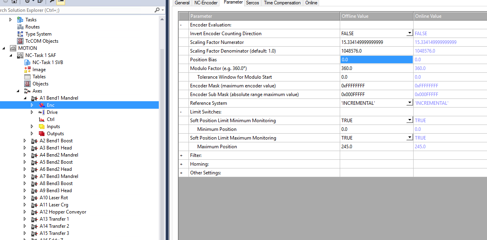
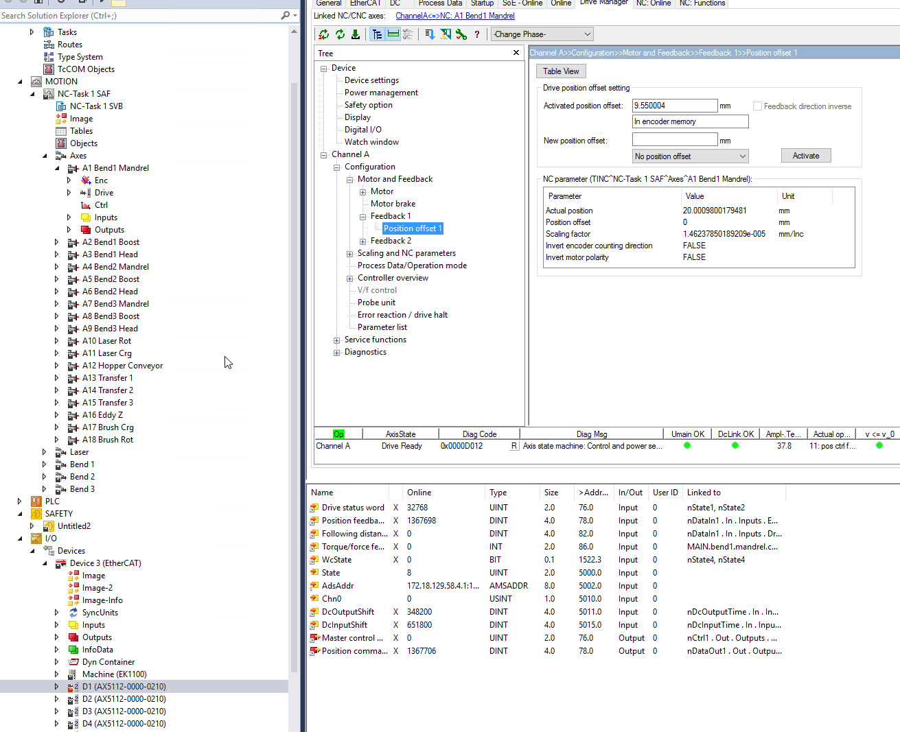
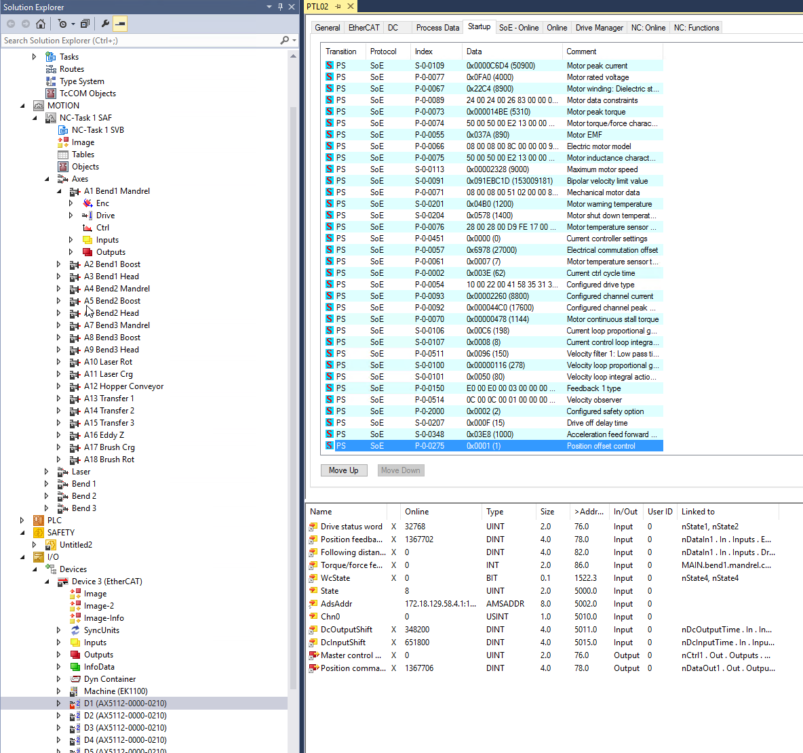

## Introduction
Commissioning a new machine is always a fun time of getting shiny new things working as expected. One item on that list is setting up all servo motor offsets. Beckhoff offers a few different ways to achieve this. Knowing the differences between them will allow you to select the correct one for the application at hand. The right selection initially will influence how changes to it are made in the future. There will inevitably be a time when the servo offset position will need to be changed, be it due to a new motor, disassembly of the linked mechanical train, slippage, etc.

Beckhoff has support for using two encoders on a single axis. There would be one encoder as part of the motor itself and is, by default, configured as Feedback 1 in the system. You may optionally add a secondary encoder, normally to the load or near the end of the mechanical train, if needed. I have not yet had to implement such a configuration, and I imagine it will be pretty rare. Everything will be based on the internal encoder supplied directly with the Beckhoff servo motors using Beckhoff drives. There will be some compatibility with non Beckhoff motion systems.

There are four different ways to save offset values and they are divided into two save methods, project/file based and motor/drive memory based.

- Inside axis configuration file (xti)
- Inside drive configuration file (xti)
- Inside motor encoder memory
- Inside drive memory

My foray into the depth of motor offsets comes from a need to only use an HMI based, persistent motor offsets. During a night shift, maintenance replaced some components and needed to change the motor offset. Up until this point the offsets were configured using axis configuration files. To be able to change the offset maintenance had access to Twincat. Long story short, not only was the motor offset changed, but half the IO configuration was also accidentally removed. Thankfully, I have all Beckhoff projects setup with source control. It took me the better part of 5 minutes the next morning to revert all incorrect changes. Now motor offsets have switched to HMI based using encoder memory.

## File Based Offsets

### Axis Configuration File
This is the easiest one to use, and perhaps the most used. It can be accessed by finding each axis in the solution explorer and opening its sub item `Enc` and looking for `Position Bias` as seen in the screenshot below.



Depending on how your project is setup, that is, using individual files for different setting or having them all inside one file, you will find this saved either in `_Config\NC\Axes\axis.xti` or your `.tsproj` file.

You will see two columns for the values, Offline and Online. Offline is the current value in the file, and this is what will be saved to disk when the file is saved. The Online value is the one currently being used. Using the buttons at the bottom you can Download the value offline -> online and Upload online -> offline. Changing this parameter does not require a twincat activation. It's a matter of changing the offline value and doing a download. Keep in mind that the axis itself will need to be disabled for this to work, otherwise there will be an error with a failed download.

The offset value can be accessed directly from the PLC. This can be useful for showing in the HMI or doing necessary calculations. It can be retrieved using [`MC_ReadParameter`](https://infosys.beckhoff.com/content/1033/tcplclib_tc2_mc2/70063115.html?id=6037410941418876873) or [`MC_ReadParameterSet`](https://infosys.beckhoff.com/content/1033/tcplclib_tc2_mc2/70064651.html?id=7147406442018531458) and written with [`MC_WriteParameter`](https://infosys.beckhoff.com/content/1033/tcplclib_tc2_mc2/70069259.html?id=5676877666559337071) or [`MC_WriteParameterPersistent`](https://infosys.beckhoff.com/content/1033/tcplclib_tc2_mc2/2220090123.html?id=2619424149840361796). Th parameter offset can be found using [`MC_AxisParameter.AxisEncoderOffset`](https://infosys.beckhoff.com/content/1033/tcplclib_tc2_mc2/70158219.html?id=3906166945109889974) or inside [`ST_AxisParameterSet.fEncOffset`](https://infosys.beckhoff.com/content/1033/tcplclib_tc2_mc2/70159755.html?id=8637087885635637733).

Pros of this approach:
- File based human readable value saving allows the integration into version control (Git)
- Easy to access and change as is found inside the axis parameters
- Can be easily read and written from the PLC

Cons:
- Writing from PLC is not persistent and does not save to file thus no version control
- Will not give an error when changing physical motor. Although I'd say most maintenance personnel know an offset would also need to be changed, but an extra layer of safety never hurts!
- If manually changing, requires doing some basic math

If you were paying close attention, you may be perplexed about me saying PLC writing is not persistent given the existence of `MC_WriteParameterPersistent`. Don't worry, I was also confused. A closer look at the documentation yields this interesting tidbit.

> The persistent parameter to be written is stored in an initialization list. At system startup, the system initially starts with the originally configured values and overwrites these with the persistent data from the initialization list before the start of the task. The initialization list is cleared when a new system configuration is registered. The system then starts with the unchanged data from the new configuration.

That would make it mostly persistent, and thus not persistent (in my mind). Mostly persistent, since it will persist across startup / shutdown including power outages, however it will be overwritten when a new configuration is activated. This can be dangerous if PLC changes are made (would normally require activation) and offsets are accidentally reverted.

In my mind this is the easiest solution with one caveat - it cannot be used if you want the possibility to set an offset from the PLC. Even if a PLC change is made and requires activation once in a blue moon, the risk of loosing any offsets is too great. I've used this one in the past and it worked great as there was no PLC reading/writing.

#### PLC Integration
Here's some demo code that can be used to read and write the Online value of the axis offset. Keep in mind, this will only work after an axis is defined and linked to the PLC and the axis is not activated.

```typescript
PROGRAM motion
VAR
	a : axis_ref;
	write: MC_WriteParameter;
	writePers : MC_WriteParameterPersistent;
	read: MC_ReadParameter;
	start: BOOL;
	start2: BOOL;
	val: LREAL;
	start3: BOOL;
END_VAR

IF start THEN
	read(
	Axis:= a, 
	Enable:= TRUE, 
	ParameterNumber:= MC_AxisParameter.AxisEncoderOffset, 
	ReadMode:= E_ReadMode.READMODE_ONCE);
	IF NOT read.Busy THEN
		start := FALSE;
        val := read.Value;
		read(axis:=a, enable:=FALSE);
	END_IF
END_IF

IF start2 THEN
	write(
	Axis:= a, 
	Execute:= TRUE, 
	ParameterNumber:= MC_AxisParameter.AxisEncoderOffset, 
	Value:= val);
	IF NOT write.Busy THEN
		start2 := FALSE;
		write(axis:=a, Execute:=FALSE);
	END_IF
END_IF

IF start3 THEN
	writePers(
	Axis:= a, 
	Execute:= TRUE, 
	ParameterNumber:= MC_AxisParameter.AxisEncoderOffset, 
	Value:= val);
	IF NOT writePers.Busy THEN
		start3 := FALSE;
		writePers(axis:=a, Execute:=FALSE);
	END_IF
END_IF
```

### Drive Configuration File
This one is similar to the axis configuration file in that it will be saved to the project's configuration. It will end up in the drive file `_Config\IO\Device 3 (EtherCAT)\D1 (AX5112-0000-0210).xti` or the `.tsproj` file. However, since it is stored inside the drive as part of the startup list it will not be in human interpretable form in the saved file. There is also no online changing of this offset as it requires an activation of the project. This is due to the [startup list](https://infosys.beckhoff.com/content/1033/ethercatsystem/2469073803.html?id=274367601078044781) needed to be loaded on startup. The value will be saved in [`P-0-0274`](https://infosys.beckhoff.com/content/1033/ax5000_idn_description/1365866379.html?id=1703175187669908577), and [`P-0-0275`](https://infosys.beckhoff.com/content/1033/ax5000_idn_description/1365896843.html?id=8983956294719486009) needs to be set to startup list value 4.

It can be accessed via the `Drive Manager`, `Configuration`, `Position Offset 1` as seen below. Select `In startuplist` from the dropdown menu to use.



Pros:
- File based non human readable format for version control (Better than nothing). Unless you figure out how to decipher the the long string of digits it uses to save it
- No math needed
- Can be read from the PLC (P-0-0274)

Cons:
- Harder to find. Need to know what drive is used for that axis
- Non human readable file store
- There is no way to write to it from PLC
- Will not give an error when changing physical motor

I've never used this option, and I don't see a reason for it and would not use it. If there's something I'm missing please let me know in the comments!

## Memory Based Offsets
These offsets are configured in the same way as the Drive Configuration File above. Refer back to the last screenshot. Each one will have its own dropdown menu entry.

Beckhoff does provide an [offset documentation](https://infosys.beckhoff.com/english.php?content=../content/1033/ax5000_function_doku_hw2/18014401660974987.html&id=4196156652723398514) explaining the difference between the two of these. The differences being the physical location of storage and errors when changing either the drive or motor hardware.

For comparison I will copy the tables found in the documentation here.

When an offset is saved in the encoder memory.

| Replaced | Result |
| -------- | ------ |
| Motor | EtherCAT status: Err PreOp. Drive status: Error F341. No position offset available |
| Motor with saved data | EtherCAT status: Op. Drive status: Ready D012 |
| Drive with or without saved data | EtherCAT status: Op. Drive status: Ready D012 |

When an offset is saved in the drive memory.

| Replaced | Result |
| -------- | ------ |
| Motor with or without data | EtherCAT status: Err PreOp. Drive status: Error F340, position offset invalid, wrong serial number |
| Drive with or without data | EtherCAT status: Err PreOp. Drive status: Error F340, position offset invalid, wrong serial number |

As can be seen, using the drive memory gives a little added protection by preventing the startup of the machine if a motor is replaced with a new motor which already has an offset stored in memory.

These values can be written directly from the PLC in a trivial way by using [`FB_SoEAX5000SetPositionOffset`](https://infosys.beckhoff.com/content/1033/tcplclib_tc2_mc2_drive/2297496075.html?id=7725800502226378192) or its variations for the AX8000 and EL7200. There is also a way to remove the offset with [`FB_SoEAX5000DeletePositionOffset`](https://infosys.beckhoff.com/content/1033/tcplclib_tc2_mc2_drive/6414373899.html?id=5657760300096918430). You will need to set the feedback channel (which will be #1 in 99.9% of the cases) using `E_PositionOffsetFeedback`. Finally the selection of drive or encoder memory using `E_PositionOffsetMemory`.

> These FBs will work if the motor is not activated (torque off), otherwise they will return an error. So make sure the estop is pressed before allowing the use of these commands on an HMI!

Pros:
- Read / write from PLC in a persistent way (There is catch)
- Writing from PLC is trivial
- No math needed
- Can prevent machine startup in the event of drive/motor replacement

Cons:
- Cannot be put into version control
- Requires the correct setting in the startup list
- Reading from PLC is not trivial and requires reading other parameters

The values are saved into [`P-0-0273`](https://infosys.beckhoff.com/content/1033/ax5000_idn_description/1365723275.html?id=6602436529418449520). The catch comes in the form of [`P-0-0275`](https://infosys.beckhoff.com/content/1033/ax5000_idn_description/1365896843.html?id=8983956294719486009). It needs to be correctly set to select the desired offset.

Setting the offset values via TwinCAT automatically adds the correct value of `P-0-0275` to the startup list. However the FBs mentioned above do not modify the startup list. For this solution to be persistent, either manually add the correct entry to the startup list, or for the first offset use the Twincat environment to set it up. Thereafter the FBs will be persistent.

Below are the values for `P-0-0275`. The startup list offset was covered in the previous section.

| P-0-0275 Value | Offset Type |
| -------------- | ----------- |
| 0 | No offset |
| 1 | Encoder memory offset |
| 2 | Drive memory offset |
| 4 | Startup list offset | 

For example, this startup list is set to use encoder memory.



#### PLC Integration
An example on how to write a new offset to the encoder memory. As can be seen, it is simple. This will only work if you have an AX5000 attached to the system and linked to the specific axis. It cannot be tested offline.

```typescript
start : BOOL;
newPos : LREAL;
axis : AXIS_REF;
soePos : FB_SoEAX5000SetPositionOffset;

IF start THEN
    soePos(
        Axis := axis,
        Execute := TRUE,
        Relative := FALSE,
        Position := newPos,
        Feedback := E_PositionOffsetFeedback.ePositionOffsetFeedback1,
        Memory := E_PositionOffsetMemory.ePositionOffsetMemory_Encoder
    );
    IF NOT soePos.Busy THEN
        soePos(Axis := axis, Execute := FALSE);
        start := FALSE:
    END_IF
END_IF
```

Reading the offset back is a little harder. Internally the AX5000 drive stores position as encoder increments in an `UDINT`. My man machine synergy isn't good enough to easily quantify and understand increments. I need it shown in millimeters or degrees! The increment offsets needs to be converted, that is going from an unsigned integer which encodes positive/negative and uses a scale to a real number.

First step is to read the two necessary parameters from the drive. These can be read as part of the axis parameter set or read individually. I will be using [`MC_ReadParameterSet`](https://infosys.beckhoff.com/content/1033/tcplclib_tc2_mc2/70064651.html?id=7147406442018531458).

```typescript
axis : AXIS_REF;
start : BOOL;
mcReadParSet : MC_ReadParameterSet;
parSet : ST_AxisParameterSet;

IF start THEN
    mcReadParSet(
        Axis := axis,
        Execute := TRUE,
        Parameter := parSet
    );
    IF NOT mcReadParSet.Busy THEN
        mcReadParSet(
            Axis := axis,
            Execute := FALSE,
            Parameter := parSet
        );
        start := FALSE;
    END_IF
END_IF
```

This gets us all kinds of information about the axis, but specifically the values in `ST_AxisParameterSet.nEncMaxIncrement` and `ST_AxisParameterSet.fEncScaleFactorInternal` will be used. The max encoder increments is the number of encoder increments per 360 degree revolution for rotary motors or increments per pole pitch (24mm) for linear motors. The scale factor is the scaling to get the mm or degree to be used in your application. Both of these are setup during the motor configuration stage in twincat drive manager under Scaling and NC parameters.

Next step is to read `P-0-0273`. This is a compound parameter, thus the easiest way to read it is to make a struct that mirrors its internal layout. The offset in encoder increments is stored in `fb1_enc_offset` for encoder memory or `fb1_drv_offset` for drive memory. I will be using `fb1_enc_offset`.

```typescript
TYPE ST_P0273 :
STRUCT
	actlength : UINT;
	maxlength : UINT;

	fb1_enc_valid : UINT;
	fb1_enc_rsvd : UINT;
	fb1_enc_offset : UDINT;
	fb1_drv_valid : UINT;
	fb1_drv_rsvd : UINT;
	fb1_drv_type : STRING(30);
	fb1_drv_rsvd1 : UINT;
	fb1_drv_serial : ULINT;
	fb1_drv_offset : UDINT;

	fb2_enc_valid : UINT;
	fb2_enc_rsvd : UINT;
	fb2_enc_offset : UDINT;
	fb2_drv_valid : UINT;
	fb2_drv_rsvd : UINT;
	fb2_drv_type : STRING(30);
	fb2_drv_rsvd1 : UINT;
	fb2_drv_serial : ULINT;
	fb2_drv_offset : UDINT;
END_STRUCT
END_TYPE
```

We are now ready to put it all together and go from offset increments to offset value. Encoder increments are stored in a UDINT which gives `2^32 -1 = 4294967295` total increments to be divided between single turn and multi turn. The default values use `2^20 = 1048576` for a single revolution and the remaining 12 bits for the multi turn resolution. That will give the motor `2^12 = 4096` turns before it rolls over. Choosing the single vs multi encoder resolution will be another post!

These two values are actually what are read from the axis parameters and what will be used. In my example, `nEncMaxIncrement = 4294967295` and the single turn value is already calculated into `fEncScaleFactorInternal = scale(mm / revolution) / 1048576`. 

The following table shows two offsets in millimeters and their associated encoder increments. I would say, generally the offset values are small compared to the total encoder resolution available. Based on these values it looks like negative offsets count backwards from the maximum encoder increment. 

| Offset | increments |
| ------ | ----- |
| 9.55 | 653046 | 
| -61.038 | 4283177520 |

I use the MSB to test whether the offset is positive or negative. This is my assumption based on my testing and has not been confirmed by Beckhoff. The implementation below shows reading `P-0-0273` and doing the necessary math to get the final offset from the increments.

```typescript
axis : AXIS_REF;
start : BOOL;
soeRead : FB_SoERead;
posOffsetstruct : ST_P0273;
posOffsetValue : LREAL;

IF start THEN
    soeRead(
        Axis := axis,
        Idn := Tc2_MC2_Drive.P_0_IDN + 273,
        Element:= 16#40,
        pDstBuf := ADR(posOffsetstruct),
        BufLen := SIZEOF(posOffsetstruct),
        Execute := TRUE,
    );
    IF NOT soeRead.Busy THEN
        soeRead(Axis := axis, Execute := FALSE);
        IF posOffsetstruct.fb1_enc_offset.31 THEN
            posOffsetValue := ( TO_LREAL(posOffsetstruct.fb1_enc_offset) - TO_LREAL(parSet.nEncMaxIncrement) ) * parSet.fEncScaleFactorInternal;
        ELSE
            posOffsetValue := posOffsetstruct.fb1_enc_offset * parSet.fEncScaleFactorInternal;
        END_IF
        start := FALSE;
    END_IF
END_IF
```

To give you a little more information here are the same offsets from above but with the other values and finally the calculated offset.

| Actual Offset | Increments | Scaling | Scaling * Offset | (Offset - max scale) * scaling |
| ------------- | ---------- | ------- | ---------------- | ------------------------------ |
| 9.55 | 653046 | 15.33415 | 9.550004311 | 62799.12838 |
| -61.038 | 4283177520 | 5.428685 | 22174.85576 | -61.03799314 |

As can be seen the offset are small compared to the full resolution. Let's see what would happen if a large offset was used. I have yet to try this and verify, but the results makes sense. For example using `2147483647` which is half of max increment count gives the following which would give you the the maximum value of the encoder before it rolls over.

| Increments | Scaling | Scaling * Offset | (Offset - max scale) * scaling |
| ---------- | ------- | ---------------- | ------------------------------ |
| 2147483647 | 5.428685 | 11117.94687 | -11117.94688 |

> If using PLC/HMI writing with `FB_SoEAX5000SetPositionOffset`. Ensure that `P-0-0275` is correctly set in the startup list!

## Conclusion
Axis Configuration Files are by far the easiest and quickest way to setup axis offsets. As mentioned, these would be the recommended way if and only if Twincat will be used to change them. (Allowing Twincat access to more people is another conversation to be had).

If HMI/PLC persistent writing is required, then either encoder or drive memory should be used. Writing these offset is trivial using the provided FBs. However, reading back the values is less than ideal, but you now have an easy way to do it!

I've hopefully covered everything you've ever wanted to know about offsets with Beckhoff. Let me know how you setup offsets in the comments or by using the form below. A quick survey is always fun!
